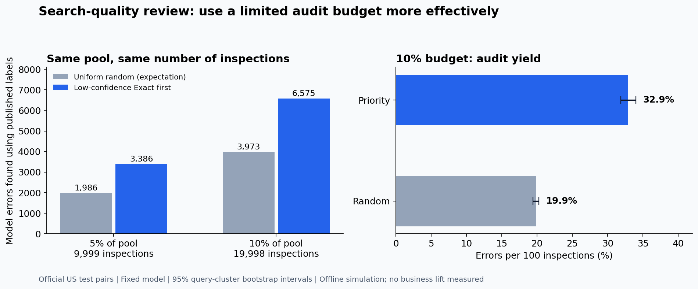

# Product Search Quality

**Which search results should a quality team inspect first?**

A local PySpark study of **1.82 million query–product judgments**, with an interpretable relevance classifier and a fixed-budget review simulation. Built independently with Codex assistance on the public [Amazon ESCI dataset](https://github.com/amazon-science/esci-data).

## Decision and evidence

**Use low-confidence Exact predictions to prioritize an audit pilot. Keep random sampling to estimate overall quality.** The model is too weak for automatic search decisions.

On the untouched official US test set, the selected model predicted **199,989** pairs as Exact. Among these, **39,729** have a published Substitute, Complement, or Irrelevant label.

| Inspect 10% of the same predicted-Exact pool | Uniform random, expected | Low-confidence Exact first |
| --- | ---: | ---: |
| Pairs inspected | 19,998 | 19,998 |
| Model errors found against published labels | 3,972.7 | **6,575** |
| Errors per 100 inspections | 19.87 | **32.88** |
| Share of pool errors found | 10.00% | **16.55%** |

The audit-yield difference is **+13.01 percentage points** (95% query-cluster bootstrap interval: **12.11–14.01 pp**, 300 replicates). This is an **offline simulation**, not completed human reviews, hours saved, conversion lift, or causal business impact. All errors receive equal weight here; their real customer costs may differ.



### A deliberate tradeoff

Class-weighted logistic regression achieved test **macro-F1 0.3334**, versus **0.1972** for a majority-class baseline. However, accuracy fell from **65.14% to 48.82%**. Complement precision is only **4.17%**. The classifier recognizes more minority-class cases, but its outputs need considerable caution.

The review result applies to the model's Exact pool, covering **46.97%** of test pairs. After the 10% audit, **83.45% of that pool's errors remain uninspected**. These limits are part of the finding.

- [Product decision memo](reports/product-decision-memo.md): operational interpretation and a proposed pilot.
- [Full test metrics](reports/test_metrics.json), [validation comparison](reports/validation_metrics.json), [independent verification](docs/validation-review.md).
- [Classification tradeoff figure](reports/figures/classification_tradeoff.png).

## What was built

- **PySpark and Spark SQL:** keyed product joins, duplicate/missing-data checks, query-group splitting, aggregation, 17 lexical features, and partitioned Parquet.
- **Spark ML:** training-only standardization and multinomial logistic regression; unweighted and inverse-frequency-weighted candidates, selected by validation macro-F1.
- **Evaluation:** per-class results, equal-item-budget audit policies, predefined slices, and query-cluster uncertainty.
- **Provenance:** immutable data revision, upstream SHA-256 verification, split hashes, frozen model/data/code hashes, and an explicit test-exposure record.

No full-catalog retrieval, vector database, LLM labeling, paid API, or cloud cluster is needed for this MVP. Spark ran as **`local[4]` on one 16 GB Apple Silicon computer** with a 4 GB driver. There is no claim that Spark outperformed pandas or that this demonstrates cloud-cluster operations.

## Data and split

| Partition | Pairs | Queries |
| --- | ---: | ---: |
| Train | 1,113,987 | 59,947 |
| Validation | 279,073 | 14,940 |
| Official test | 425,762 | 22,458 |

The US source contains **1,818,825 pairs** and **1,215,854 products**. Joining on `(product_locale, product_id)` preserved every pair with no duplicate product keys or unmatched products. One query overlaps the official train and test sets; its **3 training pairs were excluded**, preserving official test membership. Validation uses deterministic normalized-query hashing within the remaining official training data. No query IDs or normalized query texts overlap the final partitions.

See [data audit](reports/data_audit.json), [SQL audit](reports/sql_audit.json), [source manifest](data/manifests/source.json), and [frozen study](experiments/frozen_study.json). Identifiers, split membership, and labels never enter model features or review priority. Published labels score the queue only after selection.

## Reproduce locally

Tested with **Python 3.11.15, Java 17.0.20.1, PySpark 3.5.7**, and the committed `uv.lock`. Install [uv](https://docs.astral.sh/uv/getting-started/installation/) first. Allow roughly 8 GB of free disk for dependencies, data, and intermediate outputs; actual requirements vary.

```bash
uv sync --frozen --python 3.11 --group docs
uv run python scripts/bootstrap_java.py
uv run python scripts/run_study.py --name my-run
```

The study runner downloads and verifies the official files, then prepares data, trains on development partitions, freezes the study, and evaluates test once. Results go to **`.reproduction/my-run/`**; committed reference results remain intact. Choose a new run name for another technical reproduction. Repeating a frozen design does not create a new holdout or authorize tuning against the published test results.

The local Java helper supports macOS/Linux and verifies the vendor checksum. You may use an existing Java 17 installation via `JAVA_HOME`. Run focused tests after setting Java:

```bash
export JAVA_HOME="$(uv run python scripts/java_home.py)"
export SPARK_LOCAL_IP=127.0.0.1
export PYSPARK_PYTHON="$PWD/.venv/bin/python"
uv run python -m pytest -q
```

To regenerate portfolio figures or the Chinese learning PDF from reference results:

```bash
uv run python scripts/build_reports.py
uv run --group docs python scripts/build_guide_pdf.py
```

The PDF is saved locally under `reports/local/`; it is not committed. Its renderer uses an installed Chinese TrueType font; set `SEARCH_QUALITY_PDF_FONT` on systems without the macOS default. Raw data, fitted models, Spark logs, and detailed predictions are also excluded from Git.

## Learn and extend

- [中文技术手册](docs/technical-guide.zh.md): intuitive examples, Spark execution, modeling, metrics, actual findings, and interview exercises.
- [Official learning resources](docs/learning-resources.md).
- [Development case-review protocol](docs/case-review-protocol.md): 48 sampled errors, **zero completed human reviews**.
- [Current status](docs/STATUS.md), [evaluation plan](docs/evaluation-plan.md), [prior art](docs/prior-art.md), [agent instructions](AGENTS.md).

A sensible next step is human adjudication of development errors, followed by a separately evaluated semantic model or cost-sensitive audit policy. Improvements informed by this test set require a new untouched holdout for confirmatory claims.

## Attribution

This is an independent portfolio project, with no Amazon affiliation or endorsement. ESCI, the classification task, logistic regression, and Spark processing are established work. The contribution is the implementation, measurement discipline, and operational analysis.

Low-confidence prioritization is an established idea related to uncertainty sampling ([Settles, 2009](https://minds.wisconsin.edu/handle/1793/60660)); this project does not propose a new selection algorithm or run an active-learning loop. A post-implementation [prior-art follow-up](docs/prior-art.md) compares related work, including PRECISE's search-metric estimation, and documents the limits of the similarity search.

Reddy et al. (2022), [*Shopping Queries Dataset: A Large-Scale ESCI Benchmark for Improving Product Search*](https://arxiv.org/abs/2206.06588). Original project code is MIT licensed; ESCI retains its Apache-2.0 license and notices. See [THIRD_PARTY_NOTICES.md](THIRD_PARTY_NOTICES.md). Codex assisted with code, analysis, and documentation; generated claims were checked against saved outputs.
